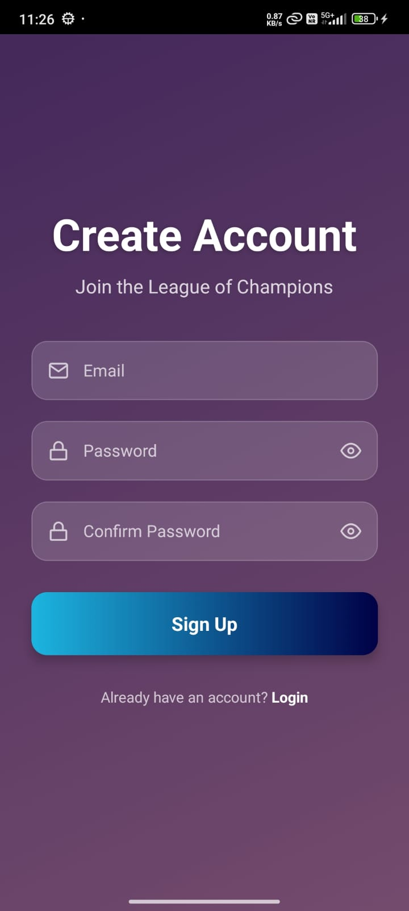
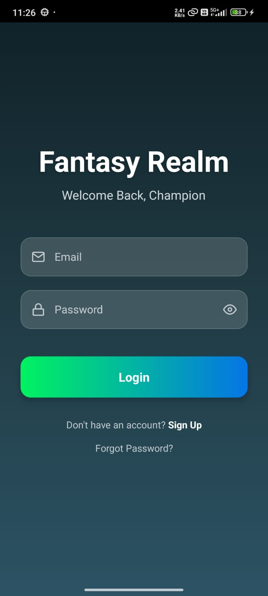
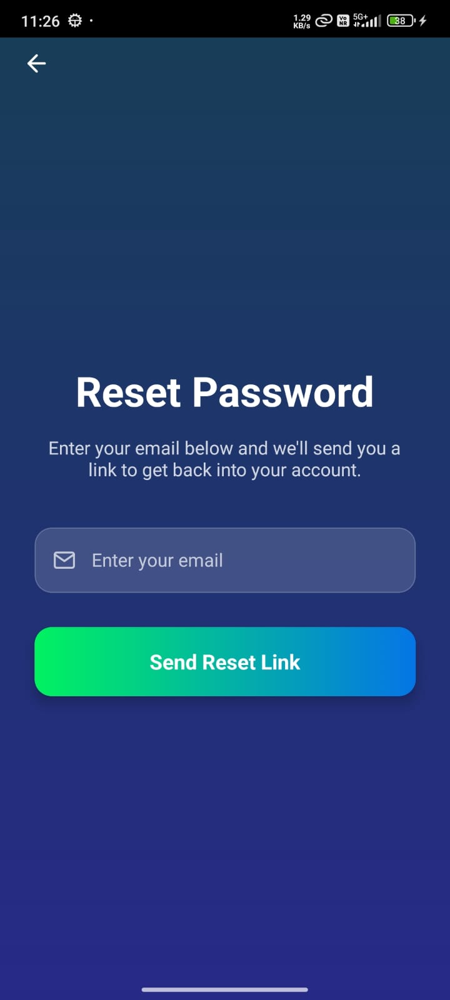
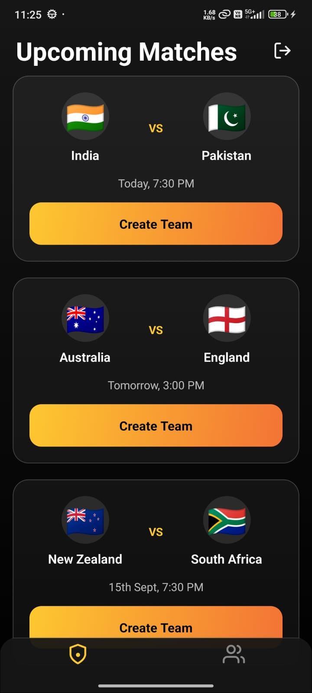
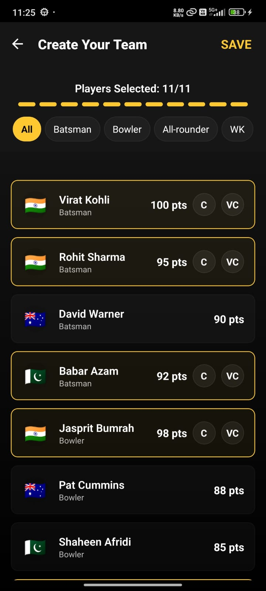
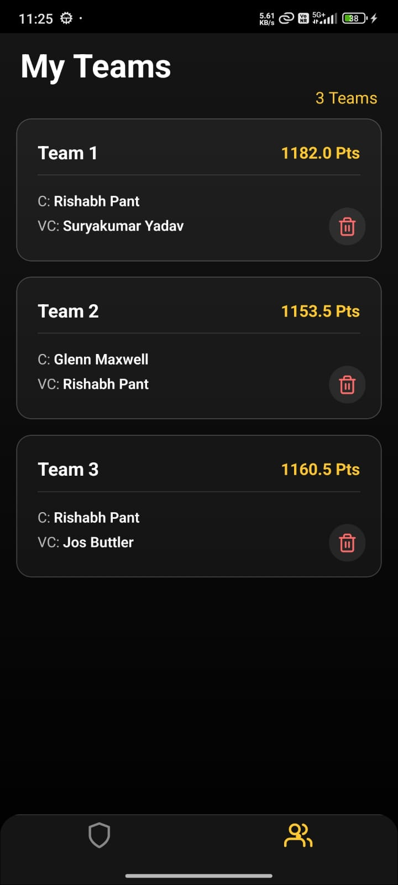
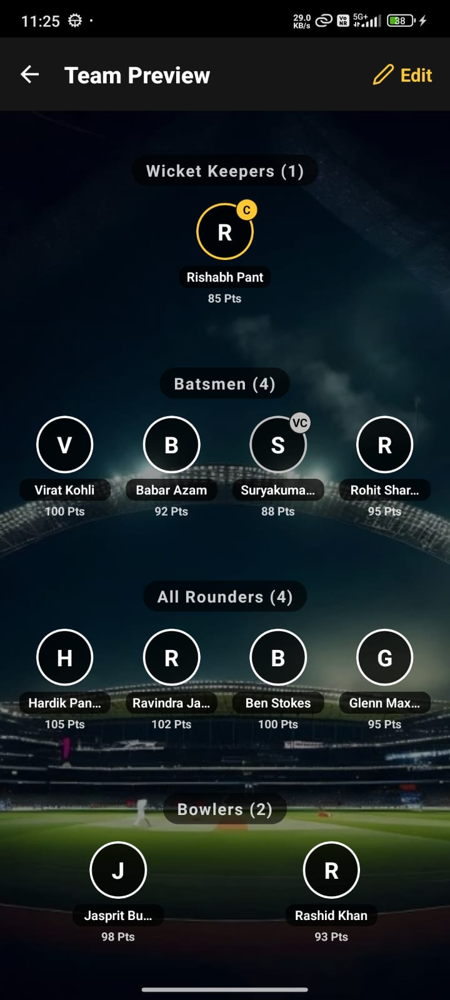

# Fantasy Realm

A fun and engaging Fantasy Sports App built using **React Native**. The app allows users to sign up, create teams, view matches, and manage their fantasy squads with a smooth UI and Firebase-powered authentication.

---


## Features

### Core Features

- **User Login & Signup:** Users can create an account or log in using Firebase Authentication.  
- **Forgot Password:** Users can reset their password via email if they forget it. The app sends a password reset link through Firebase Authentication.
- **View Matches:** Displays a list of upcoming matches for team selection.
- **Create Team:** Users can create their own fantasy team by selecting players from a match.
- **My Teams:** View all the teams a user has created in one place.
- **Team Preview:** Preview your fantasy team before finalizing.

### Bonus Features

- **Multiple Teams** Option to create multiple teams for a single match.
- **Flags & Player Data:** Teams include flags and player information for better visualization.
- **Smooth Animations & Feedback:** UI interactions like team creation, navigation, and preview offer smooth transitions and feedback.
- **Optimistic Updates:** Teams and matches update instantly in the UI while syncing with Firebase.
- **Cloud Sync:** Seamlessly sync data across devices.

---
---

<p align="center">
  <a href="https://expo.dev/accounts/kishan89/projects/Fantasy_Realm/builds/2ff51383-2c6d-4f83-a912-d0db7ea1b7eb" target="_blank">
    📲 Download Fantasy Realm APK
  </a>
</p>

---

## Screenshots

   
    
  

---

## Demo

<p align="center">
  <a href="https://drive.google.com/file/d/1hX5UG4PYz5itOE2xt4QR3yv5Z_tNZTV9/view?usp=sharing" target="_blank">Watch the App in Action</a>
</p>

---

## Tech Stack

- **Framework:** React Native (Expo)
- **Authentication:** Firebase Authentication
- **UI/UX:** React Native + Smooth Navigation + Team Flags+ linear Gradient
- **State Management:** React Hooks (`useState`, `useEffect`, `useMemo`), Redux Toolkit (teamSlice for team data)

---

## Setup & Installation

1. **Clone the repository**
   ```bash
   git clone https://github.com/Kishan89/FantasyRealm.git
   cd FantasyRealm

2. **Install dependencies**
   npm install
   # or
   yarn install

3. **Run the app**
   npx expo start

**Technical Choices:**
- React Native & Expo: Enables fast development and cross-platform support..
  I chose this because it allows building both iOS and Android apps quickly with a single codebase.
- React Hooks: Clean and maintainable state management.
  Helps keep components functional and easy to understand.
- Redux Toolkit: Used for centralized state management (teamSlice).
- LinearGradient & Dark Theme: Modern, visually appealing, and consistent UI.
  Enhances the professional look of the app.

## Project Structure

```markdown

📁 FANTASYREALM/
├── assets/
│   ├── adaptive-icon.png
│   ├── demo/
│   │   ├── forgot.jpeg
│   │   ├── login.jpeg
│   │   ├── matches.jpeg
│   │   ├── myteams.jpeg
│   │   ├── preview.jpeg
│   │   ├── signup.jpeg
│   │   └── team.jpeg
│   ├── favicon.png
│   ├── ground.png
│   ├── icon.png
│   └── splash-icon.png
├── constants/
│   ├── data.js
│   └── flags.js
├── firebaseConfig.js
├── navigation/
│   ├── AppNavigator.js
│   ├── AuthNavigator.js
│   └── RootNavigator.js
├── screens/
│   ├── ForgotPassword.js
│   ├── LoginScreen.js
│   ├── MatchListScreen.js
│   ├── MyTeamScreen.js
│   ├── SignUpScreen.js
│   ├── TeamCreationScreen.js
│   └── TeamPreviewScreen.js
├── store/
│   ├── features/
│   │   └── teamSlice.js
│   └── store.js
├── .gitignore
├── App.js
├── app.json
├── index.js
├── package.json
└── package-lock.json

```